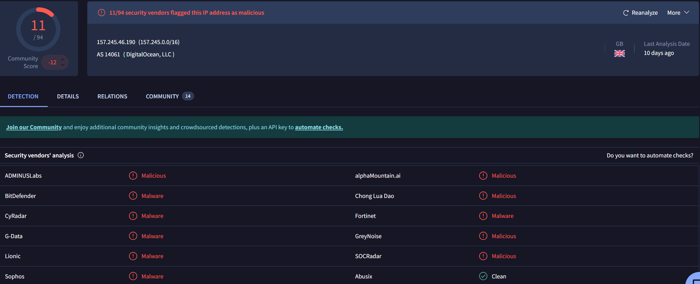

# FRONTDESK-PC1 Compromise — Password Spray to C2 Investigation

End-to-end SOC investigation of a simulated compromise on **FRONTDESK-PC1 (Kerning City Dental)**.

---

## Overview

Suspicious activity reported on an endpoint led to a full intrusion chain investigation. Using Splunk, Windows Event Logs, Sysmon, Zeek, and Suricata, the attack was traced from initial password spraying through NTLM compromise, privilege escalation, payload execution, persistence, and Sliver C2 communication.

The full attack timeline was reconstructed, IOCs were identified and validated using OSINT (VirusTotal, AbuseIPDB), and all activity was mapped to MITRE ATT&CK across 11 techniques and 8 tactics.

---

## Key Findings

- Password spraying led to successful NTLM account compromise
- Privilege escalation occurred immediately following authentication
- Microsoft Defender was disabled under SYSTEM context
- Malicious `python.exe` payload executed from a user-writable directory
- C2 communication established to external infrastructure via Sliver
- Persistence achieved through a scheduled task (`PythonUpdate`)
- Lateral movement was attempted but did not succeed

---

## Tools & Technologies

| Category | Tools |
|---------|--------|
| SIEM & Endpoint Telemetry |    |
| Network Telemetry & IDS |   |
| Threat Intelligence |   |
| Frameworks |  |

---

## Investigation Highlights

- Correlated endpoint, authentication, and network telemetry across multiple log sources
- Reconstructed full attack timeline from initial access through persistence
- Identified IOCs including malicious IP, domain, file hash, and payload path
- Validated malicious infrastructure using OSINT
- Built detection logic covering brute-force activity, suspicious execution, and C2 behavior
- Mapped activity to MITRE ATT&CK (11 techniques across 8 tactics)

---

## Detection Logic

| Detection | Data Source | Description |
|----------|------------|-------------|
| Password Spraying | Windows Event Logs (4625) | Multiple failed logons from a single source across multiple accounts |
| Successful NTLM Logon | Event ID 4624 (Type 3) | Network logon following password spray indicating account compromise |
| Privileged Logon | Event ID 4672 | Special privileges assigned immediately after authentication |
| Defender Tampering | Event IDs 5001, 5007 | Microsoft Defender Real-Time Protection disabled |
| Suspicious Process Execution | Sysmon Event ID 1 | `python.exe` executed from user-writable directory |
| C2 Communication | Sysmon 3 / Zeek / Suricata | Outbound connections to known malicious IP over uncommon ports |

---

## Investigation Evidence

### 1. Initial Access — Password Spraying

*Multiple failed logons (Event ID 4625) from a single source followed by a successful NTLM authentication, confirming a password spray leading to account compromise.*

### 2. Defense Evasion — Defender Disabled

*Event ID 5001 showing Microsoft Defender Real-Time Protection disabled under SYSTEM context shortly after initial access.*

### 3. Payload Execution

*Sysmon Event ID 1 capturing `python.exe` spawned from a user-writable directory, consistent with a dropped malicious payload.*

### 4. Command & Control (C2)

*Outbound connection to external IP over an uncommon port, corroborated across Sysmon, Zeek, and Suricata logs, indicating active C2 communication.*

### 5. Persistence Mechanism

*Scheduled task `PythonUpdate` created to maintain persistence and re-execute the payload on a recurring basis.*

### 6. Threat Intelligence — AbuseIPDB

*AbuseIPDB confirming the C2 IP had a high abuse confidence score with prior reports of malicious activity.*

### 7. Threat Intelligence — VirusTotal (Domain Reputation)

*VirusTotal flagging the associated domain as malicious across multiple threat intelligence vendors.*

### 8. Threat Intelligence — VirusTotal (Detection Ratio)

*Detection ratio confirming the C2 IP was widely flagged as malicious across multiple vendors.*

### 9. Threat Intelligence — Sliver C2 Association

*VirusTotal associating the infrastructure with Sliver, an open-source C2 framework commonly used in adversary simulations and real-world intrusions.*

---

## Lessons Learned

- Multi-source log correlation (Windows, Sysmon, Zeek, Suricata) is essential for validating attack progression end-to-end
- Weak account lockout policies significantly increase the risk of successful password spraying attacks
- Privileged logons (Event ID 4672) occurring immediately after authentication warrant immediate investigation regardless of context
- Microsoft Defender tampering (Event ID 5001) is a strong indicator of defense evasion and should trigger an escalated response
- Process execution from user-writable directories is a common and reliable indicator of malicious activity
- Correlating authentication, process, and network events is key to confirming lateral movement attempts
- OSINT enrichment via tools such as VirusTotal and AbuseIPDB strengthens confidence in identifying malicious infrastructure
- Mapping activity to MITRE ATT&CK helps surface detection gaps and drives improvements to monitoring coverage

---

## Artifacts

- [**FRONTDESK-PC1 Compromise Report (PDF)**](https://github.com/aksec88/splunk-soc-investigation-lab/blob/main/FRONTDESK%E2%80%91PC1%20Compromise_Report.pdf) — Full SOC investigation report, including analysis, detection logic, and SPL queries  

---

*All analysis was performed on simulated lab data as part of the MyDFIR Splunk-101 Capstone.*

---

## License

© 2026 Abdul Kuyateh. All rights reserved.

This project is for educational and portfolio purposes only. Unauthorized use, reproduction, or distribution of this work without permission is prohibited.

