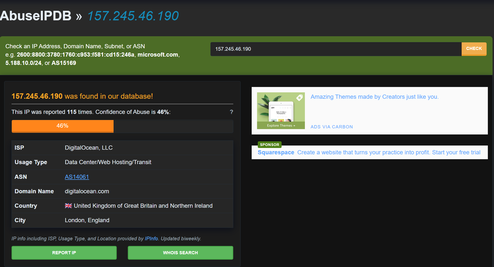

# Password Spray → C2 Compromise Investigation
*End‑to‑end SOC investigation of a simulated compromise at Kerning City Dental (KCD).*

## Project Overview
Investigated a simulated endpoint compromise using Splunk SIEM, tracing the attack from password spraying to command‑and‑control (C2) activity. Correlated Windows Event Logs, Sysmon, and network telemetry to identify initial access, payload execution, persistence, and external communication, and produced a complete incident timeline with remediation recommendations.

---

## Tools & Technologies
- Splunk (SIEM)
- Sysmon
- Windows Event Logs
- Network Telemetry
- MITRE ATT&CK Framework
- Threat Intelligence (VirusTotal, AbuseIPDB)

---

## Key Findings
- Password spraying attack with **157 failed authentication attempts**
- Successful NTLM authentication leading to account compromise
- Microsoft Defender disabled to evade detection
- Malicious payload (`python.exe`) executed from user directory
- Command‑and‑control (C2) communication to external infrastructure
- Persistence established via scheduled task (**PythonUpdate**)

---

## Investigation Highlights
- Correlated logs across **Windows Event Logs, Sysmon, and network telemetry**
- Reconstructed full attack timeline from initial access to persistence
- Identified IOCs (IP, domain, file hash, payload location)
- Mapped activity to **MITRE ATT&CK (11 techniques across 8 tactics)**
- Developed detection logic for **brute‑force activity, payload execution, and C2 behavior**

---

## Investigation Evidence

### 1. Initial Access — Password Spraying

---

### 2. Defense Evasion — Defender Disabled

---

### 3. Payload Execution

---

### 4. Command & Control (C2)

---

### 5. Persistence Mechanism

---

### 6. Threat Intelligence Validation

---

## Artifacts
- **incident_report.pdf** — Full SOC investigation report  
- **spl_queries.txt** — Key SPL queries used during analysis  

*All analysis performed on simulated lab data as part of the MyDFIR Splunk 101 Capstone.*

